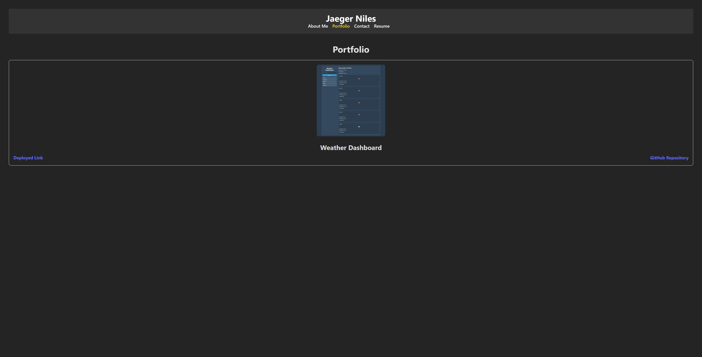

# My React Portfolio

Welcome to my React portfolio project! This portfolio showcases my skills and projects using React.js and styled-components.

## Features

- **Header:** A single header component that appears on multiple pages.
- **Navigation:** A navigation component within the header used to render different sections of the portfolio.
- **About Me:** A section providing a short bio about the developer.
- **Portfolio:** A section displaying various projects with project images, titles, and links to deployed sites and GitHub repositories.
- **Contact:** A section with a contact form allowing visitors to send messages.
- **Resume:** A section with a download link for the developer's resume and lists of proficiencies (front-end and back-end).

## Technologies Used

- React.js: Front-end JavaScript library for building user interfaces.
- styled-components: Library for styling React components using tagged template literals.

## Getting Started

1. Clone this repository to your local machine.
2. Install dependencies using `npm install`.
3. Start the development server using `npm start`.
4. Visit `http://localhost:3000` in your browser to view the portfolio.

## Folder Structure

- **components:** Contains React components for different sections of the portfolio.
- **images:** Contains images used in the portfolio (e.g., project screenshots).
- **styles:** Contains CSS or styled-components files for styling components.
- **App.jsx:** Main entry point for the React application.
- **index.css:** Global CSS styles for the entire application.
- **index.js:** Entry point for rendering the React application.

## Screenshots

## Acknowledgements

- [React](https://reactjs.org/)
- [styled-components](https://styled-components.com/)
